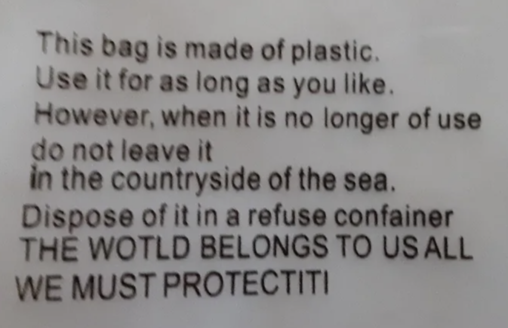

# WE MUST PROTECTITI!!!

An Explainable AI Approach to Phishing Webpage Detection

We Must PROTECTITI is a phishing-website detection system powered by machine learning and Explainable AI (XAI).
Unlike URL-only datasets, this project uses actual webpage HTML to learn structural, textual, and visual cues used by phishing pages.
Explainability tools such as SHAP, LIME, or other XAI techniques are used to make the model’s decisions transparent and trustworthy.

Because in this world, we must PROTECTITI!!!